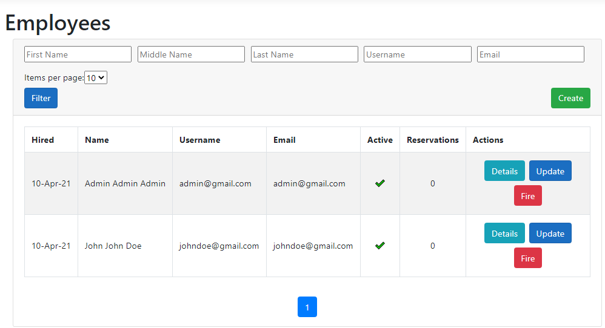
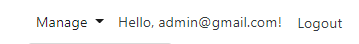
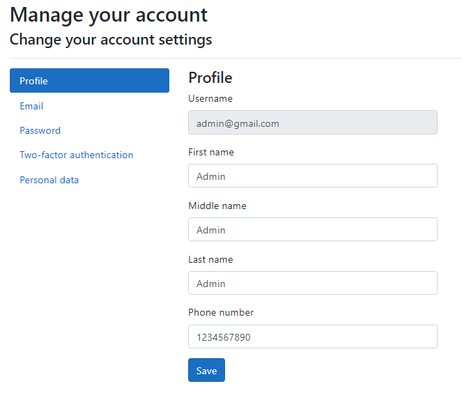
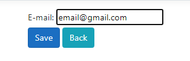
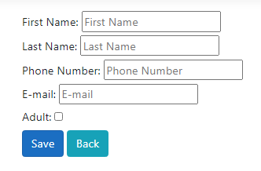
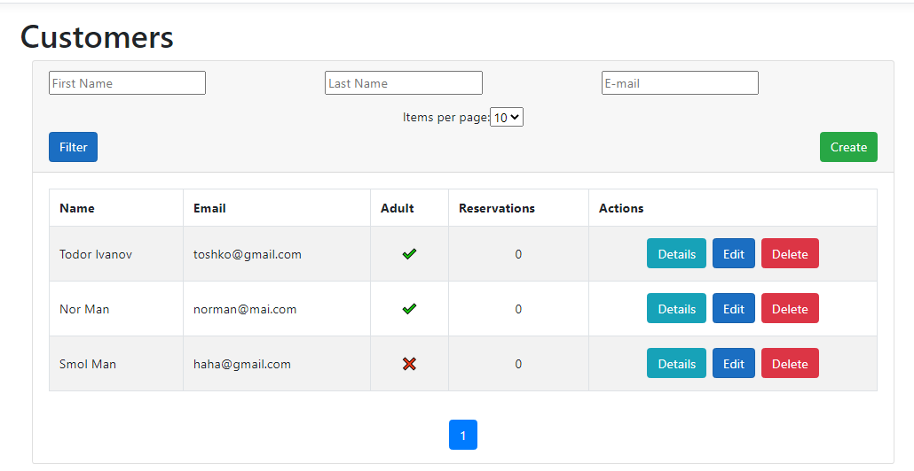
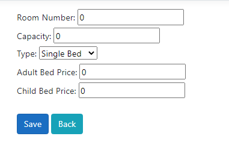
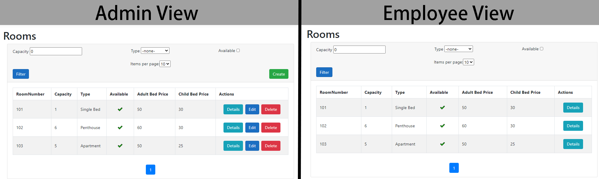
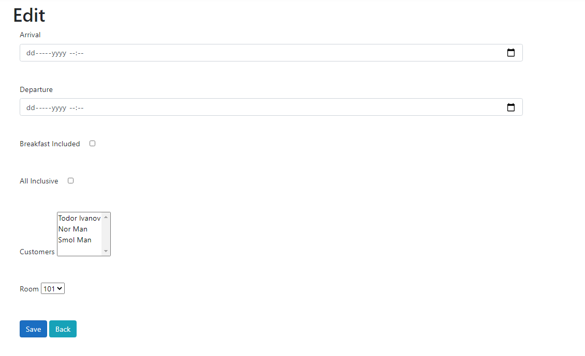
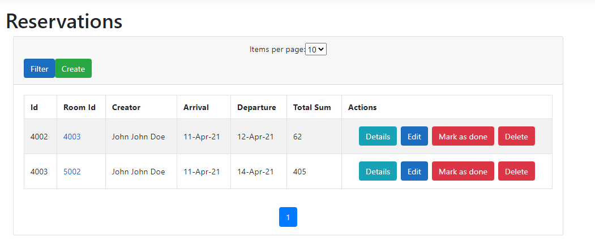

# Hotel Manager

## Description:
**Hotel Manager** is a platform that can be used in orded to create a database, responsible for keeping information about hotel reservations. The database consists of User *(Admins or Employees)*, who can create Room, Customer and Reservation entries. The goal of this platform iс to assist hotel owners and managers in keeping track of their reservations.

## Usage:
### 1. Users
Upon launching Hotel Manager, the first User that registers using the *Register menu* is marked as an **Admin**. Any subsequent registrations made by this method will result in Employee accounts. In order to create more **Admin** accounts, an already established **Admin** must select **Create Admin user** either from the *__Home__ page*, or the *__Manage__ drop down menu* located in the navigation bar.

 

Upon going to the Employees page _(either from from Manage or the Home page)_ , **Admins** are granted the ability to create employee accounts. After clicking the **Create** button and entering the required data a new Employee account is created, which is presented in the table located in the Employees page. Employees can be fired, however their information is kept in the database afterwards. In addition, actions for **Details** and **Editing** are implemented, which allow you to access a detailed view of an Employee's information at any time and change it if necessary.
 

After an account is created, the User, whether an **Admin** or an Employee, can edit their personal information by clicking on their e-mail, located next to __Manage__ in the navigation bar. 
 
 

### 2. Customers
Upon logging in as either an Employee or an **Admin**, Users are granted permission to create _Customers_. After clicking the **Create** button, the creator is asked to enter an e-mail of a _Customer_.It is then checked whether the e-mail belongs to a _Customer_ already present in the database. If it does not, a new _Customer_ is created, after their personal information is put in. If the e-mail is already in use, then the User is allowed do edit the information of the _Customer_. 

 
 

The main _Customers_ page features a table including the information of all existing _Customers_ and a filtering system that allows for searching the table for specific data. _Customer_ details can be accessed through the **Details** action which includes information about any previous and current Reservations the _Customer_ has made. Any _Customers_ entry can be edited and deleted.

 

### 3. Rooms
Unlike the _Customers_, Rooms can be created, edited and deleted only by **Admins**. When creating a room, the **Admin** is required to input its capacity, type _(Single/Double Bed, Apartment, Penthouse)_, and bed prices _(Adult Bed Price and Child Bed Price)_. 
 

Afterwards this data can be accessed through the Rooms main page, which includes a table with all the Rooms and a filter. Both Employees and **Admins** can also check the Details of existing Rooms, but only the latter can edit and delete them.
 

### 4. Reservations
In order for Users to be able to **Create** Reservations, at least one _Customer_ and Room must already exist. Upon entering the *Create* page, information about the arrival, departure, _Customer_, and add-ons(whether the Reservation is All Inclusive and includes Breakfast) are required for the Reservation to be successfully created.

 

Information about the Reservation can be accessed through the Reservations main page. The price of the Reservation is then automatically calculated. Users can mark Reservations as done. Naturally, they can also be edited and deleted. 

 

